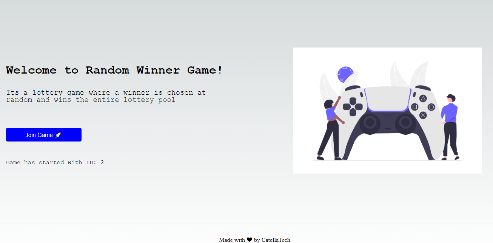

<h1 aling="center">The Graph 👷‍♂️⛓</h1>

  <a href="https://github.com/gab0071" target="_blank">
    
  </a>

  
 

  <br>
  <br>

[The Graph](https://thegraph.com/) is a decentralized query protocol and indexing service for the blockchain. It allows developers to easily track events being emitted from smart contracts on various networks, and write custom data transformation scripts, which are run in real time. The data is also made available through a simple GraphQL API which developers can then use to display things on their frontends.

<h2>How it Works</h2>


1. A dApp sends a transaction and some data gets stored in the smart contract.
2/ This smart contract then emits one or more events.
3. Graph's node keeps scanning Ethereum for new blocks and the data for your subgraph that these blocks may contain.
3. If the node finds an event you were looking for and defined in your subgraph, it runs the data transformation scripts (mappings) you defined. The mapping is a WASM (Web assembly) module that creates or updates data `Entities` on the Graph Nodes in response to the event.
4. We can query the Graph's node for this data using the [GraphQL Endpoint](https://graphql.org/learn/)

(Referenced From The Graph’s website)

<h2> Requirements </h2>

- We will be using yarn which is a package manager just like npm.
- Please install yarn from [here](https://classic.yarnpkg.com/lang/en/docs/install/#mac-stable) If your computer doesn't have yarn already installed
- Please watch this 40 minute tutorial on [GraphQL](https://www.youtube.com/watch?v=ZQL7tL2S0oQ)
- If you dont know what axios is, Watch this short [tutorial](https://www.youtube.com/watch?v=6LyagkoRWYA)

<h2>Website</h2>

- To develop the website we would be using [React](https://reactjs.org/) and [Next Js](https://nextjs.org/). React is a javascript framework which is used to make websites and Next Js is built on top of React.
- First, You would need to create a new `next` app. Your folder structure should look something like

  ```
     - RandomWinnerGame
         - graph
         - next-app
         - abi.json
  ```

- To create this `next-app`, in the terminal point to RandomWinnerGame folder and type

  ```bash
      npx create-next-app@latest
  ```

  and press `enter` for all the questions

- Now to run the app, execute these commands in the terminal

  ```
  cd my-app
  npm run dev
  ```

- Now lets install Web3Modal library(https://github.com/Web3Modal/web3modal). Web3Modal is an easy-to-use library to help developers add support for multiple providers in their apps with a simple customizable configuration. By default Web3Modal Library supports injected providers like (Metamask, Dapper, Gnosis Safe, Frame, Web3 Browsers, etc), You can also easily configure the library to support Portis, Fortmatic, Squarelink, Torus, Authereum, D'CENT Wallet and Arkane.
  Open up a terminal pointing at`my-app` directory and execute this command

  ```bash
    npm install web3modal
  ```

- In the same terminal also install `ethers.js`

  ```bash
  npm i ethers
  ```

- We will also be using `axios` to send requests to the graph, so lets install that

  ```bash
  npm i axios
  ```

<hr>
<h2> Installing / Getting started </h2>

```bash
# Clone this project
$ git clone https://github.com/gab0071/TheGraph-FRONT

# Access
$ cd TheGraph-FRONT

# Install dependencies
$ npm install

``` 
Note🚨 ➡ to interact with your smart contract in the folder `constants/index.js` write:

```js
export const RANDOM_GAME_NFT_CONTRACT_ADDRESS= "address of your NFT contract";
export const abi = "---your abi---";
```

<h2> Technologies / Built With </h2>
- Next.js
- Ethers.js
- Web3Modal

Hope you enjoy making this.


<h2>License</h2>

<p>This project is under license from MIT. For more details, see the LICENSE file.</p>

<h2>Contributing</h2>
Contributions are always welcome! Open a PR or an issue!

<br>
<br>

<p align="center">
<br/>
  Made with ❤️ by <b>catellaTech</b>.
<p/>